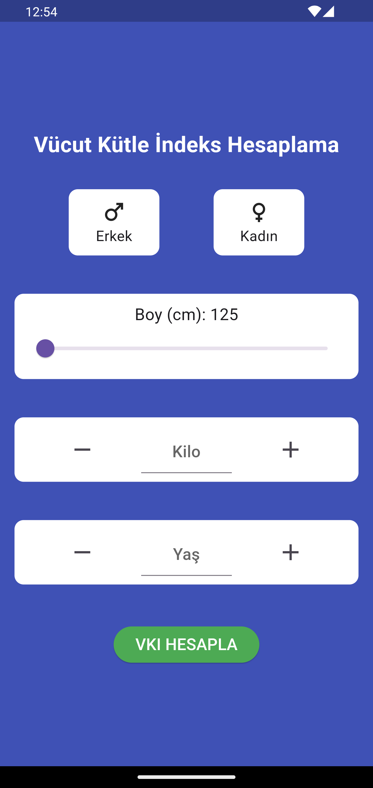
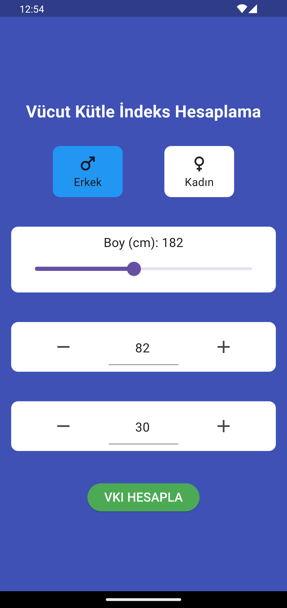
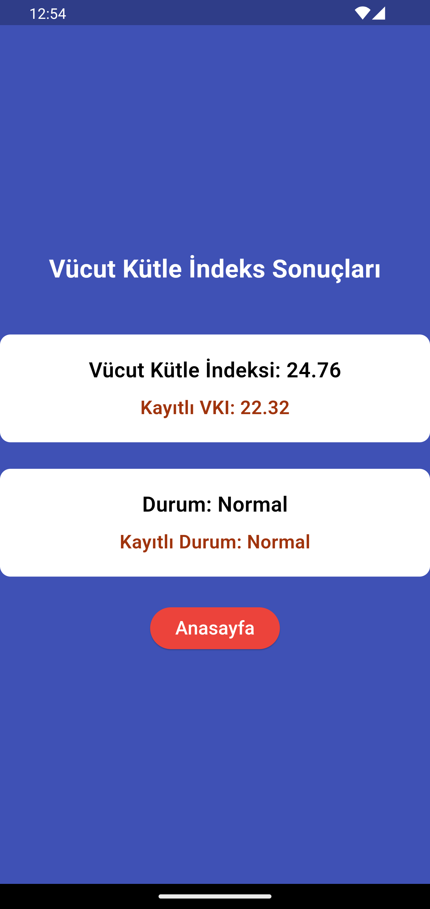

# bmi_calculate_app

Flutter ile geliştirilmiş provider mimarisi kullanılarak state yönetimleri sağlanan bir mobil Vücut Kütle İndeksi hesaplama uygulaması.

## Kullanılan Teknolojiler

- flutter
- provider
- shared preferences(Local Storage)

 

<video width="320" height="240" controls>
  <source src="assets/VKI.mp4" type="video/mp4">
</video>
